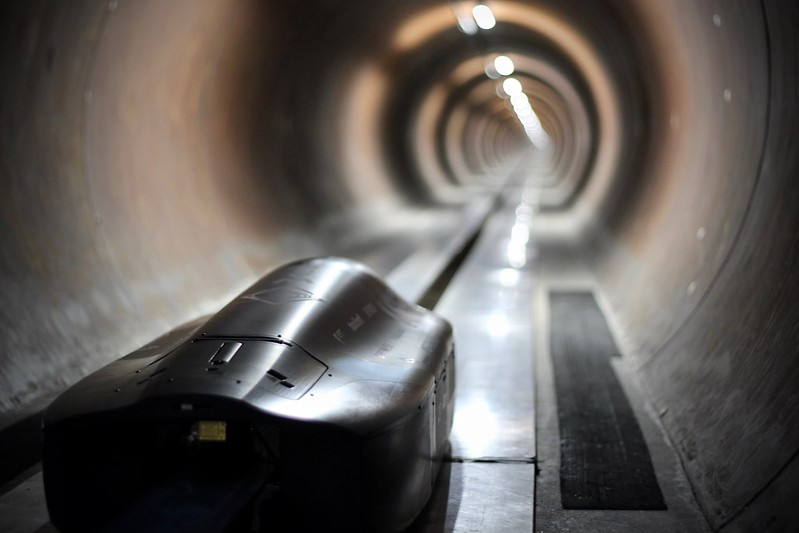
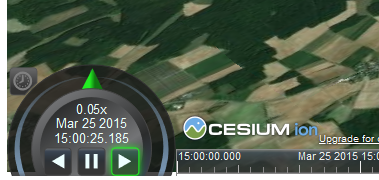
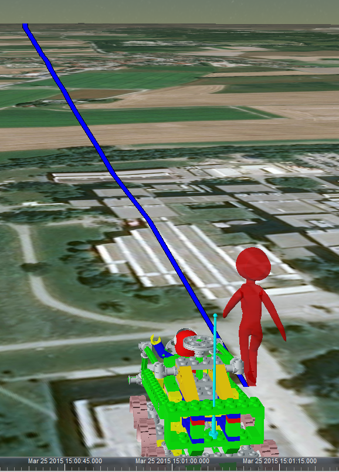
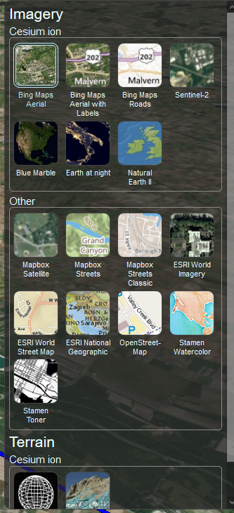
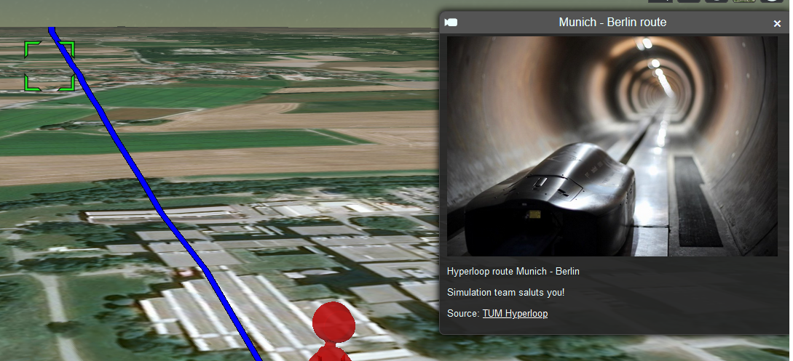
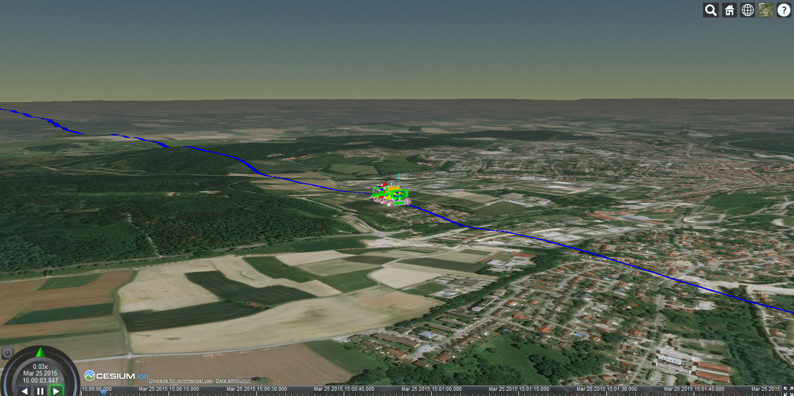

# Hyperloop Munich - Berlin route (under construction)

## Check draft view of the route Munich - Berlin!
   [Web-App](https://olaf2wysocki.github.io/) - 3D visualisation, web-app representing Munich-Berlin route

## Functionalities:

    - World terrain
    - Objects clamped to terrain
    - Static 3D objects
    - Moving 3D objects on a terrain surface
    - Animations
    - User-oriented adjustment of speed of the animation using "compass"
    - Pop-ups when clicked on the route, objects
    - Base map layer change (ortophoto map, OSM, Bing and other)

**Animation speed control via chevron**

**Static and moving objects**

**Layer change**

**Pop-ups**

**Terrain and objects clamped to the terrain surface**
